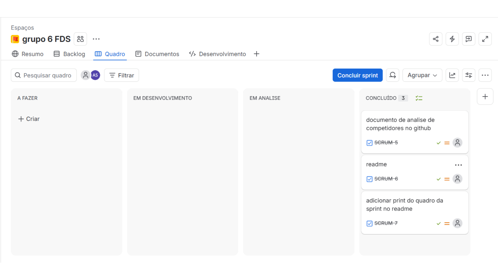
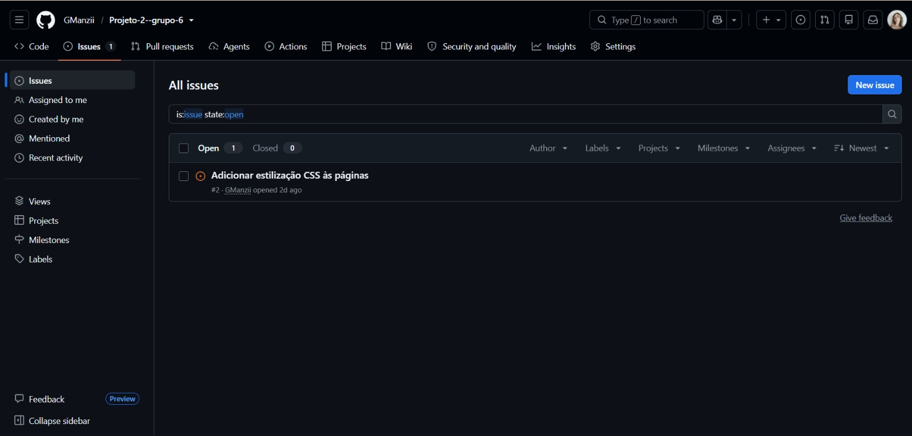
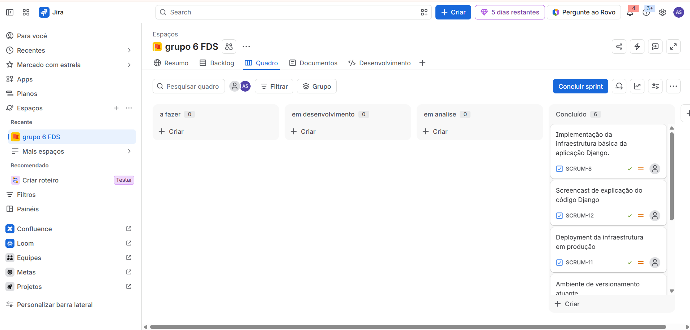

**Disciplina de Projeto 2 · Grupo 6**
# Nome do projeto: PEDRO

## Sobre o projeto
 
O PEDRO é um site e aplicativo que facilita a implementação de práticas ESG (ambiental, social e de governança) em pequenas e médias empresas.

## Tecnologias utilizadas
 
| Ferramenta | Uso |
| --- | --- |
| Python + Django | Desenvolvimento da aplicação web |
| Git + GitHub | Controle de versão e bug tracker (Issues) |
| Jira | Gestão do projeto e das sprints |
| PythonAnywhere | Deploy da aplicação |
 
---
## Como rodar o projeto localmente
 
**Pré-requisitos:** Python 3.12 ou superior e Git.
 
1. Clone o repositório e entre na pasta do projeto:
```bash
   git clone https://github.com/GManzii/Projeto-2--grupo-6.git
   cd Projeto-2--grupo-6
```
 
2. Crie e ative um ambiente virtual:
```bash
   python -m venv venv
 
   # Linux / macOS
   source venv/bin/activate
 
   # Windows
   venv\Scripts\activate
```
 
3. Instale as dependências:
```bash
   pip install -r requirements.txt
```
 
4. Crie o banco de dados:
```bash
   python manage.py migrate
```
 
5. Crie um usuário administrador (necessário para ver as mensagens enviadas pelo "Fale conosco"):
```bash
   python manage.py createsuperuser
```
 
6. Inicie o servidor:
```bash
   python manage.py runserver
```
 
O site ficará disponível em <http://127.0.0.1:8000/>.
 
---
## Entregas

### Entrega 1:
[Analise_competidores](https://github.com/GManzii/Projeto-2--grupo-6/blob/main/Analise_Competidores.md)



---

### Entrega 2:

#### Deployment
- Aplicação publicada: [https://pedroesg.pythonanywhere.com](https://pedroesg.pythonanywhere.com)

#### Screencasts

- Explicação do código: [https://youtu.be/nAHVaIYzRGQ](https://youtu.be/nAHVaIYzRGQ)

**Bug tracker (Issues)**
 
As issues do projeto estão registradas na aba [Issues](https://github.com/GManzii/Projeto-2--grupo-6/issues) do repositório.

#### Print bug tracker


#### Print da sprint

### Entrega 3:
_Em andamento._

### Entrega 4:
_Em andamento._

---

### Membros:
| Nome | E-mail |
|---|---|
| Ana Luiza Vieira Câmara | [alvc@cesar.school](https://mail.google.com/mail/?view=cm&amp;fs=1&amp;to=alvc@cesar.school&amp;su=Contato%20sobre%20o%20projeto%20de%20FDS) |
| Anna Elizabete Asfora Lisboa Santos | [aeals@cesar.school](https://mail.google.com/mail/?view=cm&amp;fs=1&amp;to=aeals@cesar.school&amp;su=Contato%20sobre%20o%20projeto%20de%20FDS) |
| Gabriela Manzi Sena Correia de Araújo | [gmsca@cesar.school](https://mail.google.com/mail/?view=cm&amp;fs=1&amp;to=gmsca@cesar.school&amp;su=Contato%20sobre%20o%20projeto%20de%20FDS) |
| Isabela Melo da Silva | [ims2@cesar.school](https://mail.google.com/mail/?view=cm&amp;fs=1&amp;to=ims2@cesar.school&amp;su=Contato%20sobre%20o%20projeto%20de%20FDS) |
| João Carlos Soares Sampaio | [jcss4@cesar.school](https://mail.google.com/mail/?view=cm&amp;fs=1&amp;to=jcss4@cesar.school&amp;su=Contato%20sobre%20o%20projeto%20de%20FDS)|
| Laís Araújo Moura | [lam2@cesar.school](https://mail.google.com/mail/?view=cm&amp;fs=1&amp;to=lam2@cesar.school&amp;su=Contato%20sobre%20o%20projeto%20de%20FDS) |
